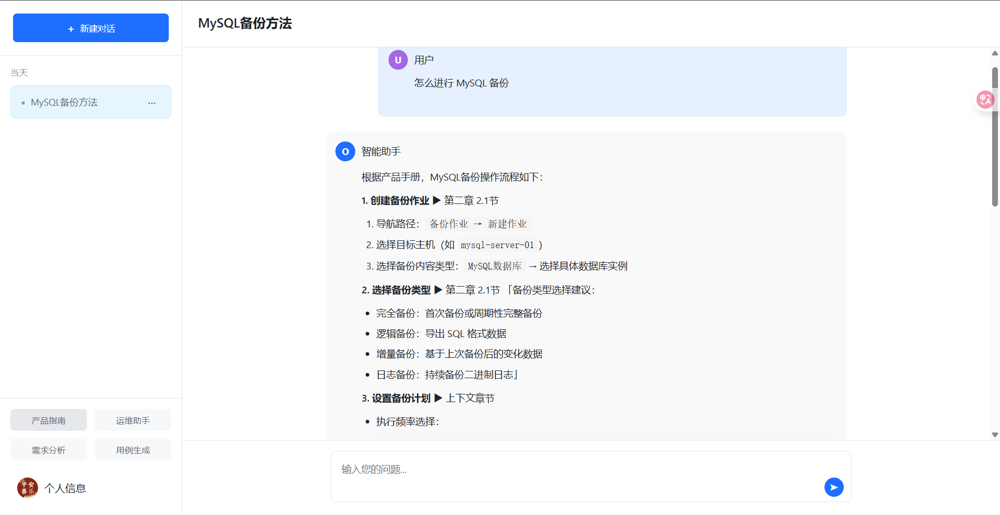
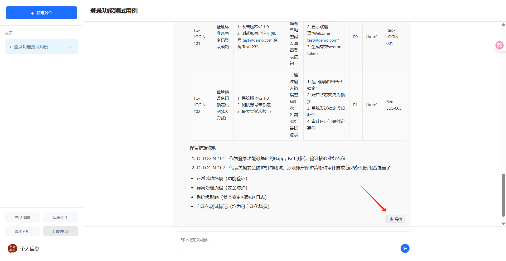
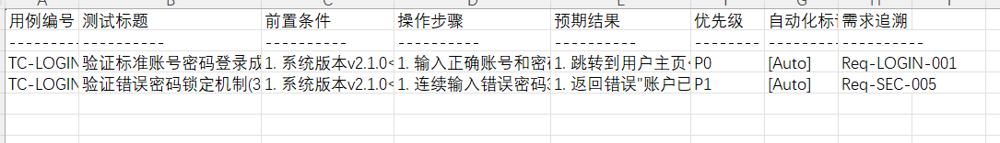
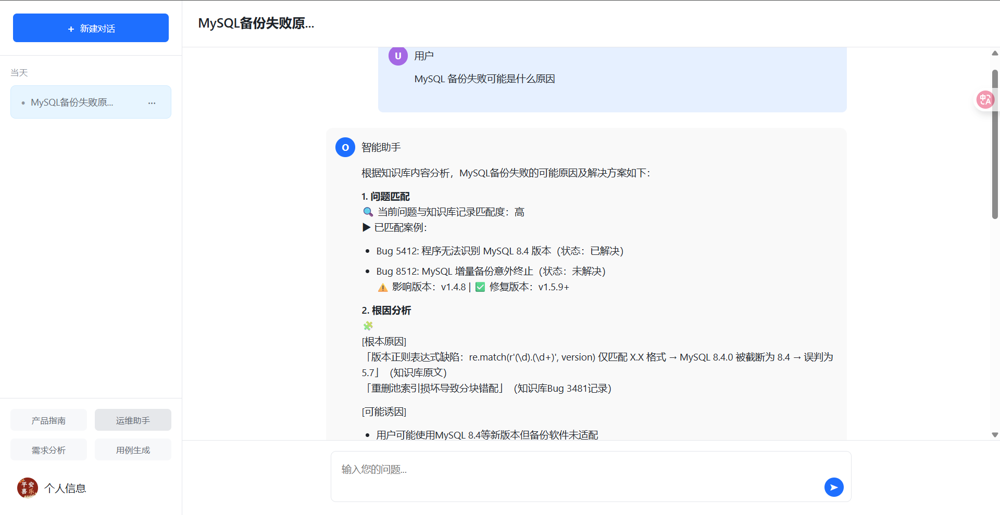

# RAG 知识库 Demo

一个基于 FastAPI 和 LangChain 构建的检索增强生成（RAG）系统，包含 **需求分析** 、**测试用例生成**、**智能运维助手**、**产品指南知识库**等内容。

## 主要功能

### 🧠 核心 RAG 功能
- 文档上传与向量化存储
- 基于语义相似度的上下文检索
- 检索增强的问答生成
- 多文档源的知识库管理

### 🌐 Web 功能
- 用户友好的问答界面
- 对话历史管理
- 实时响应流式传输

### 功能演示
产品指南知识库


支持导出测试用例



运维工单知识库


## 技术栈

### 后端
- **FastAPI** 
- **LangChain** 
- **SQLite** 

### 前端
- **Jinja2** 

### 嵌入模型
- **阿里百炼 text-embedding-v4**

### LLM模型
- **DeepSeek**

## 快速开始

### 前提条件
- Python 3.12+
- DeepSeek、阿里百炼 API KEY

### 安装步骤

1. **克隆仓库**
   ```bash
   git clone https://github.com/ChiufungLee/FastAPI_Local_RAG.git
   cd FastAPI_Local_RAG
   ```

2. **安装依赖**
   ```bash
   pip install -r requirements.txt
   ```

3. **配置环境变量**
   在根目录创建 `.env` 文件，然后填入你的配置：
   ```env
    DEEPSEEK_API_KEY="your_api_key"
    ALIYUN_API_KEY="your_api_key"
    RAG_DB_PATH = "your_local_rag_db_path"
    ALIYUN_BASE_URL = "https://dashscope.aliyuncs.com/compatible-mode/v1"
   ```

4. **启动应用**
   ```bash
   uvicorn fast_test:app --reload
   ```

5. **访问应用**
   打开浏览器访问 [http://localhost:8000](http://localhost:8000)


## 项目结构

```text
├── README.md
├── chroma_db
│   └── local_rag_db
├── fast_test.db
├── fast_test.py
├── prompts
│   ├── __init__.py
│   └── prompts.py
├── requirements.txt
├── retriever.py
├── static
│   ├── chat.css
│   ├── chat.js
│   ├── default.png
│   ├── default_avatar.png
│   └── style.css
├── templates
│   ├── chat.html
│   ├── login.html
│   └── register.html
└── utils
    └── file_handle.py
```

## API 文档

启动应用后访问以下端点查看交互式 API 文档：
- Swagger UI: [http://localhost:8000/docs](http://localhost:8000/docs)
- ReDoc: [http://localhost:8000/redoc](http://localhost:8000/redoc)


## 贡献指南

欢迎贡献！请遵循以下步骤：

1. Fork 项目仓库
2. 创建新的分支 (`git checkout -b feature/your-feature`)
3. 提交更改 (`git commit -am 'Add some feature'`)
4. 推送到分支 (`git push origin feature/your-feature`)
5. 创建 Pull Request

## 许可证

本项目基于 [MIT 许可证](LICENSE)。

## 联系信息

如有问题或建议，请联系：
- 作者：CHIUFUNGLEE
- 邮箱：lzfdd937@163.com
- GitHub Issues: [https://github.com/ChiufungLee/FastAPI_Local_RAG/issues](https://github.com/ChiufungLee/FastAPI_Local_RAG/issues)

---

**Happy RAG Practicing!** 🚀